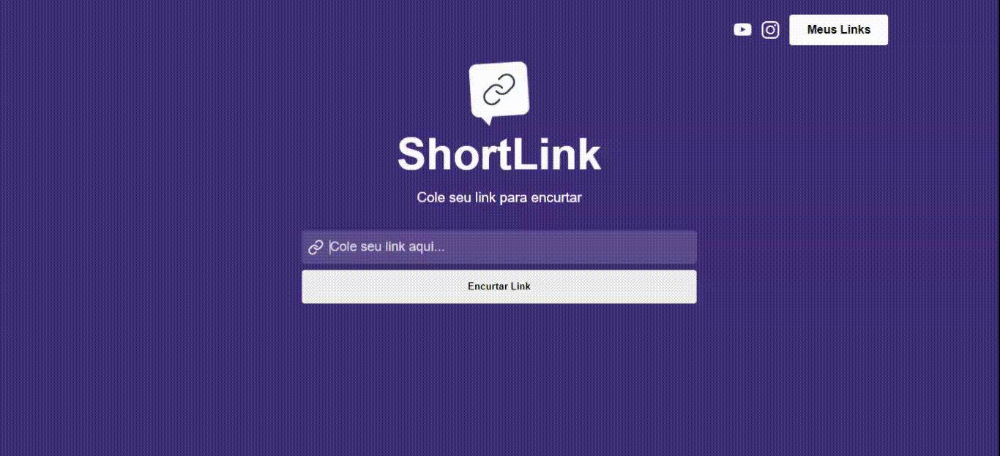
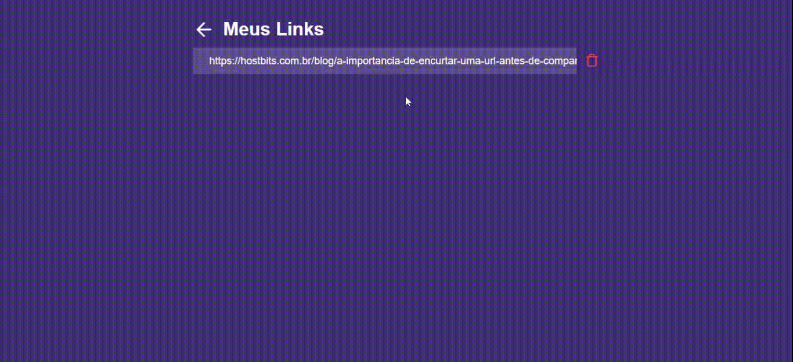

# Projeto Short Link

### Projeto desenvolvido na Semana React JS criado pelo <a href="https://github.com/devfraga" target="_blank">Matheus Fraga (Sujeito Programador)</a>, com intuito de aprimorar e enriquecer os conhecimentos relacionados a biblioteca React JS.

## O projeto
### Desenvolver um site capaz de encurtar URLs.

- Para quem não sabe, encurtar uma URL vai muito além do aspecto visual. Essa é uma questão de organização e controle que traz vantagens para uma estratégia de marketing digital.

- Postagens no Twitter, por exemplo, podem ser otimizadas pelo uso de URLs encurtadas, o que garante mais espaço para seus textos (a rede social já até possui um processo automatizado para isso!). Já no Facebook, é uma boa usar os links encurtados para facilitar a leitura dentro de posts grandes, além de facilitar o compartilhamento dos endereços.

Leia mais no blog  <a href="https://bit.ly/3LgxtlF">HostBits</a>.

